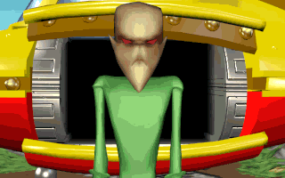

<figure>

<figcaption>An Esmer.</figcaption>
</figure>

**Esmers** is a general name for the inhabitants of
[Zeelich](Zeelich "wikilink") used by [Twinsunians](Twinsun "wikilink").
It is based on the Twinsunians' initial belief that the "Esmers" come
from [Emerald Moon](Emerald_Moon "wikilink") instead of Zeelich (Esmers
= people from Emerald Moon). But despite better knowing it has evolved
to meaning Zeelichians, as even [FunFrock](FunFrock "wikilink"), knowing
their origins from the first time, uses the term "Esmers". The Esmers
themselves prefer the name Zeelichians.

The Esmers are actually four different species: the
[Sups](Sup "wikilink"), the [Francos](Franco "wikilink"), the
[Wannies](Wannie "wikilink") and the [Mosquibees](Mosquibee "wikilink").
The term "race" is also often used to describe differences, though the
official term is species.

The term Esmer can be found next to any activities and objects by
Zeelichans, as far as they are known or happened on Twinsun.

## The Esmer invasion

  
*Main Article: [Esmer invasion](Esmer_invasion "wikilink")*

A part of FunFrock's and the [Emperor](Emperor "wikilink")'s plan to
destory [Twinsun](Twinsun "wikilink") needed the power of the Twinsunian
wizards. Realising that it wouldn't be easy to get control on them, they
started a mission to Twinsun, inviting the wizards to
[Zeelich](Zeelich "wikilink").

Pretending they wanted to help with the restoration of the [Temple of
Bù](Temple_of_Bù "wikilink"), they build a [secret
base](Esmer_base "wikilink") in [Bald
Mountain](Bald_Mountain "wikilink") for their shuttles to land and get
off. Agents of the SBI are sent to remote places of the islands.

As the Emsers can't just leave Twinsun after capturing the wizards, they
establish military control over the populace instead.

Image:Screenshot-lba2-movies-03-esmers_arrival-SORT374.gif\|Esmer
shuttles approaching Twinsun
Image:Screenshot-lba2-movies-03-esmers_arrival-SORT571.gif\|Esmers
landing on Citadel Island
Image:Screenshot-lba2-ingame-citadel_island-lupin_burg.gif\|Esmers in
Lupin-Burg
Image:Screenshot-lba2-movies-12-children_abduction-ENFA362.gif\|An Esmer
spaceship abducting the children Image:Esmers_lupin_burg.jpg\|Esmer
patrols Image:Mine_field.jpg\|A land mine field by the Esmers

During the military presence of the Esmers on
[Twinsun](Twinsun "wikilink") Esmer troops and robots are guarding the
streets, many public places such [Chez Luc](Chez_Luc "wikilink") and
[Miss Bloop's Private Museum](Miss_Bloop's_Private_Museum "wikilink")
are closed, along with the [ferry](ferry "wikilink") services.

Mine fields are seen on [Desert Island](Desert_Island "wikilink"),
making it hard to use the guarded streets.

With the prepared destruction of Twinsun with the [lunar
reactors](Emerald_Moon_base "wikilink"), however, more and more Esmers
leave the planet, bringing themselves out of danger.

## Esmer Spaceships

  
*Main Article: [Esmer shuttle](Esmer_shuttle "wikilink")*

The yellow Esmer spaceships can usually be found at the
[astroport](astroport "wikilink") in [Otringal](Otringal "wikilink"),
carrying passengers to various planets. However, they are also used for
military purposes, like for the invasion of
[Twinsun](Twinsun "wikilink"), at the [Emerald Moon
base](Emerald_Moon_base "wikilink"), or as the
[Emperor](Emperor "wikilink")'s personal spacecraft to get from [Island
CX](Island_CX "wikilink") to [Otringal](Otringal "wikilink").

The shuttles' round outside makes them perfectly able to fly through
space. Upon landing, big red feet extend from its bottom, and a side
door opens.

The shuttles are controlled by [itinary
tokens](itinary_token "wikilink").

Image:Screenshot-lba2-movies-03-esmers_arrival-SORT676.gif\|Esmer
spaceship on Citadel Island
Image:Screenshot-lba2-movies-07-esmers_shuttle-VOYAGEZ09.gif\|Esmer
shuttle in space Image:MONT CH.preview.JPG\|Esmer shuttle emerging from
Bald Mountain Image:Shuttle.jpg\|Esmer shuttle from the inside

## Famous Esmers

Image:Johnny Rocket.jpg\|[Johnny Rocket](Johnny_Rocket "wikilink"), the
first Emser on Twinsun Image:John Edgar H..jpg\|[John Edgar
H.](John_Edgar_H. "wikilink"), agent of the SBI Image:Emperor.jpg\|The
[Emperor of Zeelich](Emperor_of_Zeelich "wikilink")

## Related threads

### General

- [Your fave esmer
  charactar](https://forum.magicball.net/showthread.php?t=4990)
- [The Esmers
  invasion](https://forum.magicball.net/showthread.php?t=5358)
- [The Esmers](https://forum.magicball.net/showthread.php?t=5259)
- [Twinsun - a happy jolly place? I THINK
  NOT](https://forum.magicball.net/showthread.php?t=155)

### Hints\Spoilers

- [The funniest hints ever, & more! (Could anybody tell some
  more)](https://forum.magicball.net/showthread.php?t=3842)

### Fan Art

- [Esmer Shuttle In
  3D/movie](https://forum.magicball.net/showthread.php?t=650)
- [Esmer Shuttle](https://forum.magicball.net/showthread.php?t=4788)
- [Lba3](http://forum.magicball.net/showthread.php?p=112171#post112171)
- [Esmer drawing](https://forum.magicball.net/showthread.php?t=11891)

### Fan Fiction

- [The Esmer Menace (In
  progress!)](https://forum.magicball.net/showthread.php?t=5441)
