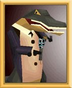

<figure>

<figcaption><a href="Patrick" title="wikilink">Patrick</a>, a
gloum</figcaption>
</figure>

**Gloums** are large Alligator-like creatures on
[Otringal](Otringal "wikilink"). Almost all gloums there work in [Casino
Gloum](Casino_Gloum "wikilink").

Owning the casino in the [middle city](middle_city "wikilink") of
Otrinal, the gloums tell [Twinsen](Twinsen "wikilink") about the big
jack-pot he can win there. However, when arriving at the [Jackpot
Room](Jackpot_Room "wikilink"), Twinsen is attacked by two gloums, who
steal all of his money in case they defeat him. After Twinsen beats
them, he can exit the casino through the back door, leading to
Otringal's [Upper City](Upper_City "wikilink").
