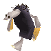

<figure>

<figcaption>A Wannie</figcaption>
</figure>

Kind of big moles who stand on two feet. They live in families in
comfortably furnished caves. Their favorite place is the
[under-gas](under-gas "wikilink") because they can't survive on the
surface without protecting themselves against the light (with
sunglasses, big black capes, etc.). Traditionally miners from generation
to generation, they sift the under-gas lava to extract gems for the
[Building Company](Building_Company "wikilink") which, in exchange,
protects them from the monsters.

## Related threads

### General

- [didier sent me this a while
  back](https://forum.magicball.net/showthread.php?t=4798)

### Fan Art

- [3D Franco guard and
  Wannie](http://forum.magicball.net/showthread.php?p=267063#post267063)
- [Old Fan Art](https://forum.magicball.net/showthread.php?t=2697)
- [DarkMonk-Art
  thread](https://forum.magicball.net/showthread.php?t=11780)

## External links

### Fan Art

[Wannie](http://www.deviantart.com/view/16452498/)
