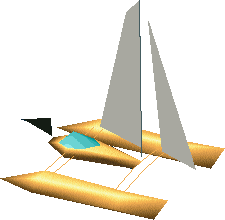

<figure>

<figcaption>The catamaran with the <a href="pirate_flag"
title="wikilink">pirate flag</a> attached.</figcaption>
</figure>

The **catamaran** is a yellow boat owned by
[Twinsen](Twinsen "wikilink") in Little Big Adventure 1. He uses it to
get from one island to another on [Twinsun](Twinsun "wikilink")'s
[Southern Hemisphere](Southern_Hemisphere "wikilink").

Twinsen buys the catamaran from a [sphero](sphero "wikilink") sailor at
[Port-Belooga](Port-Belooga "wikilink") for 200
[Kashes](Kash "wikilink"). He needs it to get to islands that are not
available via [ferry](ferry "wikilink") or the
[Fisherman](Fisherman "wikilink")'s boat, such as [Proxima
Island](Proxima_Island "wikilink") or the [Hamalayi
Mountains](Hamalayi_Mountains "wikilink").

By attaching a [pirate flag](pirate_flag "wikilink") he stole from the
[Maritime Museum](Maritime_Museum "wikilink") on
[Proxim-City](Proxim-City "wikilink") to the catamaran, Twinsen gives a
proof of his good intentions to the [rebels](rebel "wikilink") on
[Rebellion Island](Rebellion_Island "wikilink"), and is thus able to
dock there.

## Related threads

- [buying the boat
  thing](https://forum.magicball.net/showthread.php?t=12620)
- [where's my catamaran
  :(](https://forum.magicball.net/showthread.php?t=12743)
