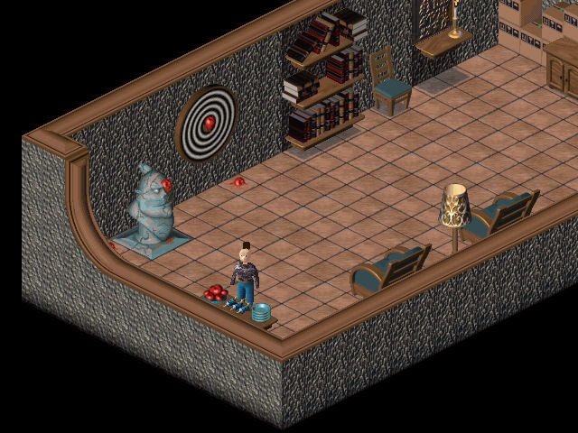

**Darts** are one of the weapons in [Little Big Adventure
2](Little_Big_Adventure_2 "wikilink"). They do little damage, and only
on very weak enemies, such as [snakes](snake "wikilink") and
[crabs](crab "wikilink"). Three darts are usually available for the
price of 4 [kashes](kashes "wikilink"), but they can also be found for
free at some places. After throwing a dart, it can be retrieved by
simply walking over it.

<figure>

<figcaption>Twinsen facing 3 darts in his house</figcaption>
</figure>

[Twinsen](Twinsen "wikilink") uses the darts very little in the game. He
first finds three darts in [his house](Twinsen's_house "wikilink"),
where he can throw on either the nearby darts baord or
[FunFrock](FunFrock "wikilink")'s bust for [life
candies](life_candies "wikilink") and [magic
flasks](magic_flasks "wikilink").

The darts come in more use at [Temple Park](Temple_Park "wikilink"),
where Twinsen uses them at the duck shooting game to win balloons that
bring him into the Temple of Bù. In this game, Twinsen is given three
darts, and has to hit one duck in three shots. If he manages to do so
before the final shot, he keeps the darts left for the rest of his
adventure.

## Related threads

### General

- [Darts](https://forum.magicball.net/showthread.php?t=8282)

### Hints\Spoilers

- [Twinsen Odyssey-Dart
  Help](https://forum.magicball.net/showthread.php?t=857)

### Fan Art

- [pictures!](https://forum.magicball.net/showthread.php?t=4645)
