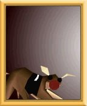

<figure>

<figcaption>A Duam</figcaption>
</figure>

**Duam** are a dog-like race used for gambling races in the
[casino](casino "wikilink") on [Otringal](Otringal "wikilink").

The Duams race is one of the games available at the casino.
[Twinsen](Twinsen "wikilink") can place a bet of 1
[Zlito](Zlito "wikilink") on any of the Duams, and if the Duam he bets
on wins the race, Twinsen is awarded 10 Zlitos.

It's possible to cheat in this race, by dispensing a [life
candy](life_candy "wikilink") from the [Horn of the Blue
Triton](Horn_of_the_Blue_Triton "wikilink") on any of the courses. The
duam who touches this heart becomes faster, and is more likely to win
this race.

## Related threads

### General

- ["A Duam" ???? WTF is
  that?](https://forum.magicball.net/showthread.php?t=1969)

### Hints\Spoilers

- [Otringal Casino](https://forum.magicball.net/showthread.php?t=2522)
- [Dog races.](https://forum.magicball.net/showthread.php?t=2534)
