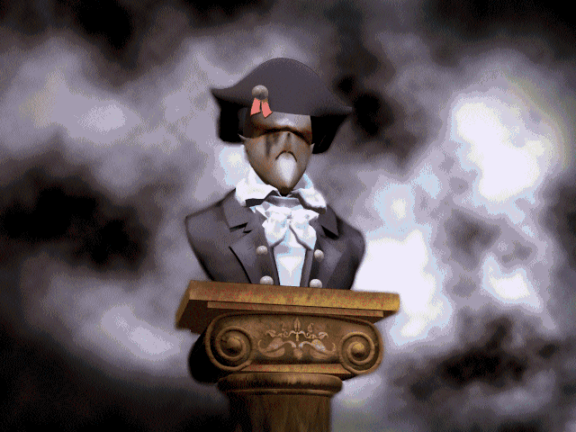

<figure>

<figcaption>Statue of the Emperor of <a href="Zeelich"
title="wikilink">Zeelich</a></figcaption>
</figure>

**The Emperor of Zeelich** is [Dr. FunFrock](Dr._FunFrock "wikilink")'s
right hand in his attempt to destroy [Twinsun](Twinsun "wikilink") by
imposing as [Dark Monk](Dark_Monk "wikilink"). In this attempt, FunFrock
spread the propaganda that Dark Monk was reincarnated.

Because the Priests of [Zeelich](Zeelich "wikilink") believed it, they
suspected [Twinsen](Twinsen "wikilink") of stealing the [key
fragments](Dark_Monk's_key "wikilink") while he actually borrowed them
to prevent harmful use by the Emperor and FunFrock. The Emperor actually
wanted to be the master of Zeelich. He had overwhelming armies in
comparison with the dissidents and army of [Queen
Astrid](Astrid "wikilink"). He sent those armies as a way to avoid a
failure of his plan.

Twinsen meets the emperor on [Island CX](Island_CX "wikilink"), where he
kills him. Just before he dies, the emperor manages to trigger the
switch that activates the reactor on [Emerald
Moon](Emerald_Moon "wikilink") that causes the moon to hurl towards
[Twinsun](Twinsun "wikilink"). Upon the emperor's death, he drops a key
that Twinsen uses to steal the [Emperor's
Sword](Emperor's_Sword "wikilink") from the chest in the room.

## Related threads

### Fan Art

- [Another Emperor](https://forum.magicball.net/showthread.php?t=7692)
- [Emperor wallpaper](https://forum.magicball.net/showthread.php?t=4336)
- [Emperor](https://forum.magicball.net/showthread.php?t=4236)

## External links

### Fan art

- [Emperor of
  Zeelich](http://www.deviantart.com/deviation/7406127/?qo=81&q=by%3Asepulchrave&qh=sort%3Atime+-in%3Ascraps)
- [Emperor of Zeelich 2](http://www.deviantart.com/view/16452412/)
