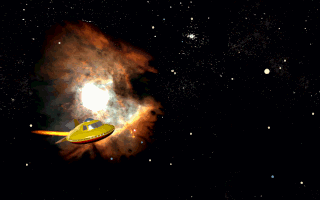
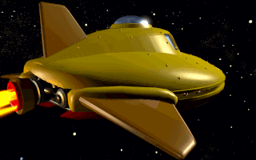
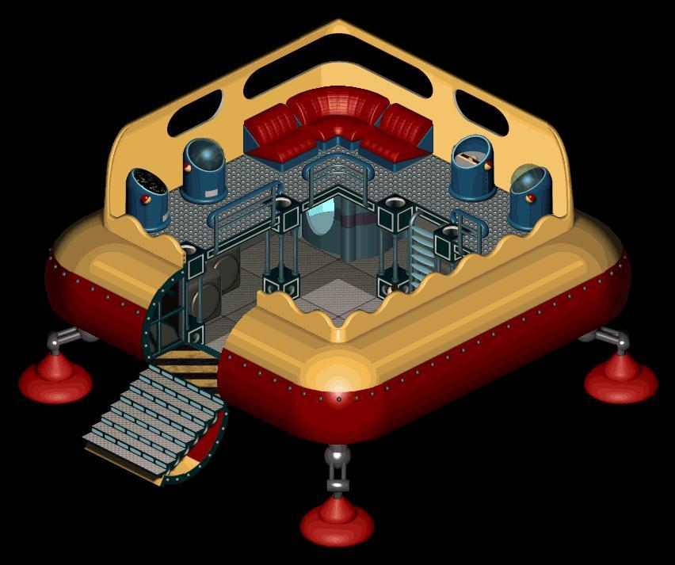
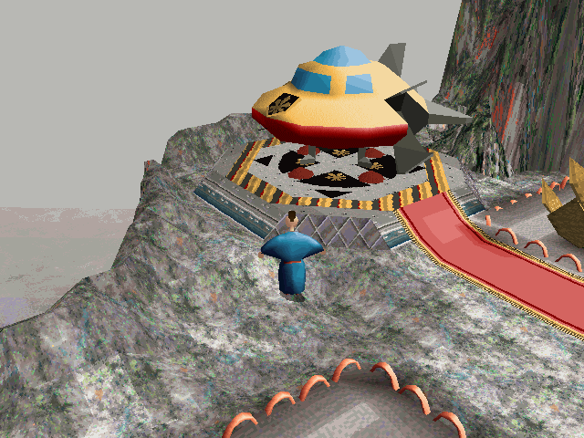
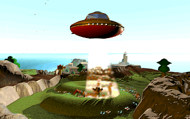
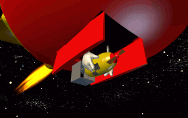

<figure>

<figcaption>Esmer shuttle in-flight through space</figcaption>
</figure>

The **Esmer shuttle** is a flying ship used for transportations of
persons and goods. It's most remarkable for being able to make
inter-planetary flights, but can also be used for flights within the
atmosphere of a planet.

This shuttle was developed by and is most frequently used by
[Esmers](Esmer "wikilink"), particularly the [Sups](Sup "wikilink"). It
was first spotted on [Twinsun](Twinsun "wikilink") not long before the
[Esmer invasion](Esmer#The_Esmer_invasion "wikilink").

There is just one standardized model of the shuttle, allowing the use of
efficient space ports, standard sized landing pads, and it eases
maintenance and production. The [Emperor of
Zeelich](Emperor_of_Zeelich "wikilink") had his [personal
shuttle](#The_Emperor\'s_shuttle "wikilink") customized slightly.

The esmer shuttle is the only known means of transportation between
[Zeelich](Zeelich "wikilink"), [Twinsun](Twinsun "wikilink") and the
[Emerald Moon](Emerald_Moon "wikilink") next to [Baldino's
Spaceship](Baldino's_Spaceship "wikilink"), which is revealed only after
the Esmers land on Twinsun.

### Exterior

<figure>

<figcaption>Esmer shuttle exteriour as seen from the side</figcaption>
</figure>

The shuttle is shaped much like a saucer. The top of the shuttle's body
with the cockpit is yellow while the bottom is coloured red. The shuttle
has several flexible feet that allow for comfortable landings, but are
contracted during flight. The exhaust pipe for the engine can be seen at
the back of the shuttle. Around the body are three stabilatory wings,
mostly useful for flying within a planet's atmosphere.

There is one door in the shuttle that is lowered after landing, doubling
as stairs to get inside or out. The cargo hold also has a door located
at the bottom of the shuttle, but this is hardly used, mostly for
dropping large objects in-flight. A pair of mechanical arms can be used
to lower and release the specific cargo.

<figure>

<figcaption>Esmer shuttle interiour, showing the shuttle's controls and
cargo bay</figcaption>
</figure>

### Interior

Getting inside the shuttle, the passenger finds himself in the cargo
hold. This is well reachable so loading and unloading is easy. It's
mostly empty apart for a storage room for space suits which can be found
in all shuttles.

At the top of the shuttle, reachable by a ladder, is the passengers
lounge and shuttle controls.

### Controls

The shuttle is usually not manually controlled, but rather flies on
auto-pilot using an [Itinary Token](Itinary_Token "wikilink"). This
token has to be retrieved from the respective control tower before
take-off and has the flight pattern programmed in it. The passenger
simply has to insert it into the designated slot in the shuttle's
cockpit to start the flight, after which he may sit back comfortably.

### The Emperor's shuttle

<figure>

<figcaption>The Emperor's shuttle seen from the outside, parked right
across the <a href="Emperor&#39;s_palace" title="wikilink">Emperor's
palace</a>. The <a href="emperor&#39;s_emblem"
title="wikilink">emperor's emblem</a> is visible here</figcaption>
</figure>

The [Emperor of Zeelich](Emperor_of_Zeelich "wikilink") has a customized
version of the esmer shuttle. It is basically the same as any other, but
it's slightly more luxurious and it carries the [emperor's
emblem](emperor's_emblem "wikilink") on the front exterior.

## In the game

The esmer shuttles have a big role in [Twinsen](Twinsen "wikilink")'s
second adventure. Not only does he travel in them himself, but the
Esmers also use them for various tasks during significant parts
throughout the adventure.

Twinsen first encounters the Esmer shuttle among with many other
Twinsunians, when [Johnny Rocket](Johnny_Rocket "wikilink")'s shuttle
lands on [Citadel Island](Citadel_Island "wikilink") and others on
[Desert Island](Desert_Island "wikilink"). During his journeys, Twinsen
travels in a shuttle several times:

1.  When traveling to [Otringal](Otringal "wikilink"),
    [Zeelich](Zeelich "wikilink") while disguised as a Twinsunian
    wizard;
2.  When escaping the [prison](Otringal_prison "wikilink") there and
    returning to Twinsun. This time he crashes his shuttle in the [Ridge
    of the Flowers Circle](Ridge_of_the_Flowers_Circle "wikilink") on
    the [Citadel Island cliffs](Citadel_Island_cliffs "wikilink");
3.  When traveling to the [moon base](moon_base "wikilink") on [Emerald
    Moon](Emerald_Moon "wikilink"), departing from the [secret esmers
    base](secret_esmers_base "wikilink") on [Desert
    Island](Desert_Island "wikilink");
4.  Using the Emperor's shuttle, to get from [Island
    CX](Island_CX "wikilink")

to [upper-town](Upper_city "wikilink") Otringal, right outside the
[Emperor's palace](Emperor's_palace "wikilink").

</li>
</ol>

<figure>

<figcaption>The shuttle dragging up the children</figcaption>
</figure>

The Emperor's troops use a shuttle to kidnap the children of
[Twinsun](Twinsun "wikilink"). The shuttle drags the children onto it
using an unknown beaming function.

<figure>

<figcaption>The bomb held by mechanical arms, right before dropping it
into the moon base's reactor.</figcaption>
</figure>

A very significant event involving the esmers shuttle is when the Esmers
realize their mistake of blindly following their Emperor and the
falsified [Dark Monk](Dark_Monk "wikilink"). They drop a bomb carried by
a shuttle into the moon base, stopping it from hurling towards Twinsun
in combination with [Sendell](Sendell "wikilink")'s powers channeled
through Twinsen at that time. This was the only time when the shuttles
are used for anything different than transporting people and goods.

## Related threads

### Fan Art

- [Esmers
  shuttle](http://forum.magicball.net/showthread.php?p=34217#post34217)
- [pictures!](http://forum.magicball.net/showthread.php?p=111337#post111337)
