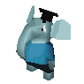

<figure>

<figcaption>A Grobo</figcaption>
</figure>

**Grobo** is one of the four main species of
[Twinsun](Twinsun "wikilink"). The official [Little Big Adventure
2](Little_Big_Adventure_2 "wikilink") website describes them as so:

The Grobos are spread everywhere around the planet, and are not centered
in one place. In [Little Big Adventure
1](Little_Big_Adventure_1 "wikilink"), [grobo
clones](grobo_clones "wikilink") are also very common.

## Related threads

### Fan Art

- [Lba3](http://forum.magicball.net/showthread.php?p=84457#post84457)
- [My x-mas art](https://forum.magicball.net/showthread.php?t=4757)
- [Ancient Grobos](https://forum.magicball.net/showthread.php?t=4617)

## External links

### Fan art

- [Inor and Claudia](http://www.deviantart.com/view/11302613/)
