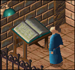

<figure>

<figcaption>A book mentioning the Legend of Sendell, in the Censored
Publications Department of the <a href="Principal_Island"
title="wikilink">Principal Island</a> <a href="library"
title="wikilink">library</a>.</figcaption>
</figure>

**The Legend of Sendell**, referred to by many people as **The Legend**,
tells the story of the Heir. He is the descendant of a line of chosen
creatures who live on the surface to serve [Sendell](Sendell "wikilink")
in times of danger. The Legend comes to bitter truth in [Little Big
Adventure 1](Little_Big_Adventure_1 "wikilink").

This is the centuries old legend, as described in books:

[Twinsen](Twinsen "wikilink"), as far as he knows, is a common quetch
living on [Twinsun](Twinsun "wikilink") during the dictatorship of [Dr.
FunFrock](Dr._FunFrock "wikilink"). He has strange dreams in which
Sendell is calling him. When he tells the
[pharmacist](pharmacist_(quetch) "wikilink") about it, he is imprisoned
in the [Citadel](Citadel "wikilink"), a place from which no one had ever
escaped. Twinsen manages to flee and goes home to his girlfriend
[Zoé](Zoé "wikilink").

She, too, is imprisoned and taken away by FunFrock's soldiers. In the
search for his girlfriend and the truth about the Legend, Twinsen
discovers that he in fact is the very Heir, destined to overthrow the
evil tyrant FunFrock, as described in the Legend itself.
