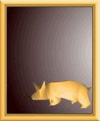

<figure>

<figcaption>A schmoutz</figcaption>
</figure>

A **Schmoutz** is a yellow creature which looks like a fusion of a puppy
dog and a pig. These creatures are kept as pets by
[Zeelichians](Zeelich "wikilink").

The [Wannie](Wannie "wikilink") family who eat Fire-Fly tarts have one.
There is also one wandering the [Wannie Mines](Wannie_Mines "wikilink").
The old [Sup](Sup "wikilink") woman at the [Imperial
Hotel](Imperial_Hotel "wikilink") can be found playing with hers as
well.
