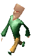

<figure>

<figcaption>Sup</figcaption>
</figure>

## Description

This humanoid race has a huge triangular head and a thin body. The Sups
live mainly on the island of [Otringal](Otringal "wikilink"). They are
the intellectual elite of the planet [Zeelich](Zeelich "wikilink") where
they dominate the other races, imposing their iron rule on all and
sundry in the name of [their Emperor](Emperor_of_Zeelich "wikilink").
Their advanced technology allows them to travel from galaxy to galaxy
and attempt to populate other planets. The Emperor and [Dark
Monk](Dark_Monk "wikilink") appear to maintain excellent relations...

## Related threads

### List of famous Sups

- [Emperor of Zeelich](Emperor_of_Zeelich "wikilink") - Dark Monk's
  right-hand guy.
- [Johnny Rocket](Johnny_Rocket "wikilink") - first ever
  [Esmer](Esmer "wikilink") to set foot on
  [Twinsun](Twinsun "wikilink").
- [Rick](Rick "wikilink") - Owner of [Rick's
  Café](Rick's_Café "wikilink").

### General

- [Sups vs.
  Mosquibee's!](https://forum.magicball.net/showthread.php?t=4677)
- [Which race do you consider closest to
  humans?](https://forum.magicball.net/showthread.php?t=4303)

### Fan art

- [For those interested to see what a cell-shaded LBA would look
  like](https://forum.magicball.net/showthread.php?t=6222)
- [Esmer drawing](https://forum.magicball.net/showthread.php?t=11891)
- [Zeelich - Sup
  render](https://forum.magicball.net/showthread.php?t=12533)
