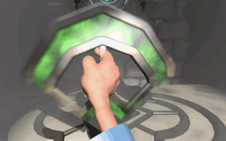

<figure>

<figcaption>The Wannies Fragment</figcaption>
</figure>

## Description

The **Wannies Fragment** was one of the four fragments which together
summoned [Dark Monk's Statue](Dark_Monk's_Statue "wikilink") to complete
the ceremony. This turned [Zeelich](Zeelich "wikilink") back in its
original look after 10,000 ceremonies. The Wannies Fragment is the green
"above" piece of [Dark Monk's Key](Dark_Monk's_Key "wikilink").

## Role in Twinsen's adventure

As a part of his quest of uniting the four key fragments,
[Twinsen](Twinsen "wikilink") had to find the Wannies Fragment. It was
located in a room in the [Wannies Mines](Wannies_Mine "wikilink"),
protected by the [a huge guard](Wannie_Chapel_Guard "wikilink"). After
killing the guard, Twinsen retrieved the key to the room. In there, it
turned out that the room looked like [Dark Monk's
Chapel](Dark_Monk's_Chapel "wikilink"), but then with a fragment. After
taking the fragment, Twinsen had to fight his way out, as the
[Wannies](Wannie "wikilink") in the mine wanted their fragment back.

## Unconfirmed theories

After picking up the Wannies Fragment, Twinsen heard a voice speaking to
him. It might have been the real [Dark Monk](Dark_Monk "wikilink"), who
was making sure the whole [prophecy](prophecy "wikilink") would be
fullfilled.

## Additional quotes

## Related threads

### General

- [Has anyone emailed our good ol' Fred
  about...](https://forum.magicball.net/showthread.php?t=10899)
- [The mine on the Wannies
  island](https://forum.magicball.net/showthread.php?t=5086)
- [Dark Monk](https://forum.magicball.net/showthread.php?t=5777)
- [The wannies
  fragment](https://forum.magicball.net/showthread.php?t=3606)

### Hints\Spoilers

- [how do you get the keypart on
  wannies?](https://forum.magicball.net/showthread.php?t=11882)

### Fan Art

- [The replaced art](https://forum.magicball.net/showthread.php?t=3190)
