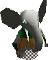

**Yellow Grobo Clones** were observer clones created by [Dr.
FunFrock](Dr._FunFrock "wikilink"). They were not capable of fighting
for FunFrock, and therefore were used as normal workers, for example to
keep an eye on the passengers at the [Citadel
Island](Citadel_Island_harbour "wikilink") and [Principal
Island](Principal_Island_harbour "wikilink") harbours. They are seen
guarding a closed gate or [Twinsen's house](Twinsen's_house "wikilink")
on [Citadel Island](Citadel_Island "wikilink"), too.

In order to get to [Principal Island](Principal_Island "wikilink"),
[Twinsen](Twinsen "wikilink") has to use the [ferry](ferry "wikilink").
The gate to the harbour, however, is blocked by a yellow grobo clone.
After defeating it with his [magic ball](magic_ball "wikilink"), Twinsen
is able to get onto the ferry.

 In [Funky
Town](Funky_Town "wikilink"), [Twinsen](Twinsen "wikilink") encounters a
yellow grobo clone without a helmet. For a certain amount of
[money](Kash "wikilink"), Twinsen bought information from the grobo
clone about the plans of the [Teleportation
Center](Teleportation_Center "wikilink") being in [FunFrock's
headquarters](FunFrock's_headquarters "wikilink").

Though the clones are present on other places, they are not important in
the game most of the time.

A portrait of a yellow grobo clone is found in [Miss Bloop's Private
Museum](Miss_Bloop's_Private_Museum "wikilink"). It has a safe hidden
behind it.
